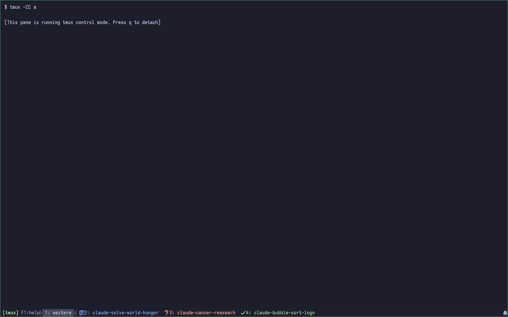

# WezTerm Config

## Claude Operator Console



Modular [WezTerm](https://wezfurlong.org/wezterm/) configuration with Catppuccin Mocha theme, tmux integration, and quality-of-life extras.

## Features

- **Catppuccin Mocha** color scheme with translucent, borderless window
- **Tmux integration** — auto-detects tmux panes, session picker (`Ctrl+Shift+A`), context-aware tab rename
- **20-20-20 health reminders** — status bar warning every 20 minutes to look away for 20 seconds
- **Claude Code tab tracking** — tabs change color by state: blue (running), peach (needs input), green (done)
- **F1 cheat sheet** — overlay listing all keybindings

## Structure

| File | Purpose |
|------|---------|
| `wezterm.lua` | Entry point — loads modules, merges keybindings, sets up status bar |
| `theme.lua` | Catppuccin Mocha palette + tab title rendering with pane style registry |
| `claude.lua` | Registers Claude Code tab state styles (running/asking/idle) with theme |
| `keys.lua` | Pane splits, kill pane, Shift+Enter passthrough, F2 rename |
| `tmux.lua` | Tmux detection, binary resolution, session picker, left status |
| `health.lua` | 20-20-20 reminder with toggle |
| `help.lua` | F1 keybinding cheat sheet |
| `hooked/claude-state.sh` | Claude Code hook — emits WezTerm user vars for tab state (Linux) |
| `hooked/claude-state.zsh` | Claude Code hook — same as above (macOS) |

## Keybindings

| Key | Action |
|-----|--------|
| `Ctrl+Shift+D` | Split horizontal |
| `Ctrl+Shift+E` | Split vertical |
| `Ctrl+Shift+K` | Kill pane (no confirm) |
| `Ctrl+Shift+O` | Pane select (jump) |
| `Shift+Enter` | CSI u sequence (tmux-safe) |
| `F2` | Rename tab / tmux window |
| `Ctrl+Shift+A` | Tmux session picker |
| `Ctrl+Shift+H` | Toggle health reminder |
| `F1` | Help overlay |

## Install

```bash
git clone https://github.com/connormclaud/wezterm.git ~/.config/wezterm
```

WezTerm hot-reloads on save. To validate syntax:

```bash
wezterm --config-file ~/.config/wezterm/wezterm.lua ls-fonts
```

## Claude Code Tab Tracking

Tabs visually indicate Claude Code state in background tabs:

| State | Color | Indicator |
|-------|-------|-----------|
| Running | Blue | `…` |
| Needs input | Peach | `?` |
| Done | Green | `✓` |

State clears automatically when Claude Code exits (`SessionEnd` hook).

This uses [Claude Code hooks](https://code.claude.com/docs/en/hooks). Add to `~/.claude/settings.json`:

```json
{
  "hooks": {
    "UserPromptSubmit": [{
      "hooks": [{ "type": "command", "command": "$HOME/.config/wezterm/hooked/claude-state.sh running", "async": true }]
    }],
    "PreToolUse": [
      {
        "matcher": "AskUserQuestion|ExitPlanMode",
        "hooks": [{ "type": "command", "command": "$HOME/.config/wezterm/hooked/claude-state.sh asking", "async": true }]
      },
      {
        "matcher": "^(?!AskUserQuestion$|ExitPlanMode$)",
        "hooks": [{ "type": "command", "command": "$HOME/.config/wezterm/hooked/claude-state.sh running", "async": true }]
      }
    ],
    "PostToolUse": [{
      "matcher": "AskUserQuestion|ExitPlanMode",
      "hooks": [{ "type": "command", "command": "$HOME/.config/wezterm/hooked/claude-state.sh running", "async": true }]
    }],
    "PermissionRequest": [{
      "hooks": [{ "type": "command", "command": "$HOME/.config/wezterm/hooked/claude-state.sh asking", "async": true }]
    }],
    "Notification": [
      {
        "matcher": "permission_prompt|elicitation_dialog",
        "hooks": [{ "type": "command", "command": "$HOME/.config/wezterm/hooked/claude-state.sh asking", "async": true }]
      },
      {
        "matcher": "idle_prompt",
        "hooks": [{ "type": "command", "command": "$HOME/.config/wezterm/hooked/claude-state.sh idle", "async": true }]
      }
    ],
    "Stop": [{
      "hooks": [{ "type": "command", "command": "$HOME/.config/wezterm/hooked/claude-state.sh idle", "async": true }]
    }],
    "SessionEnd": [{
      "hooks": [{ "type": "command", "command": "$HOME/.config/wezterm/hooked/claude-state.sh", "async": true }]
    }]
  }
}
```

On macOS, use `claude-state.zsh` instead — it resolves the TTY via `ps` rather than `/proc`.

## See Also

- [KevinSilvester/wezterm-config](https://github.com/KevinSilvester/wezterm-config) — feature-rich modular config with background selector, GPU adapter picker, and CI linting
- [dragonlobster/wezterm-config](https://github.com/dragonlobster/wezterm-config) — clean single-file config with a great YouTube walkthrough
- [awesome-wezterm](https://github.com/michaelbrusegard/awesome-wezterm) — curated list of WezTerm plugins and resources
- [catppuccin/wezterm](https://github.com/catppuccin/wezterm) — official Catppuccin theme for WezTerm

## License

[MIT](LICENSE)
