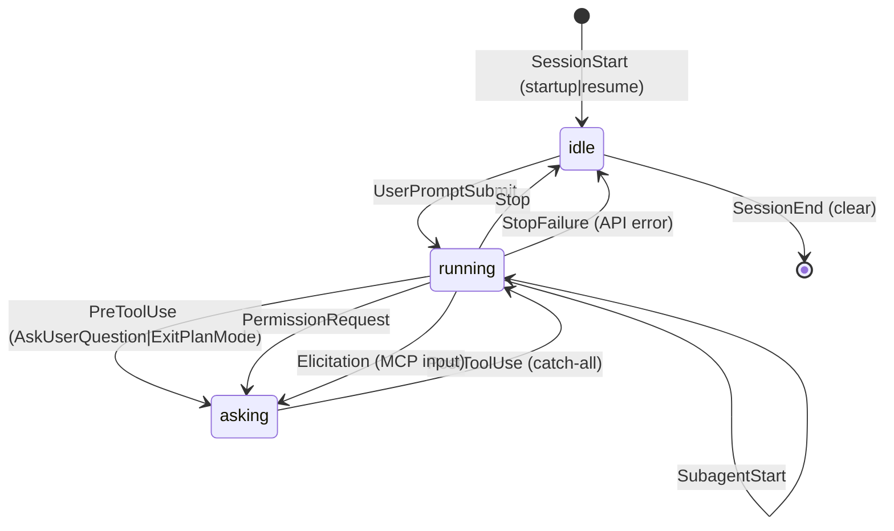
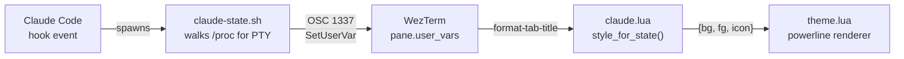
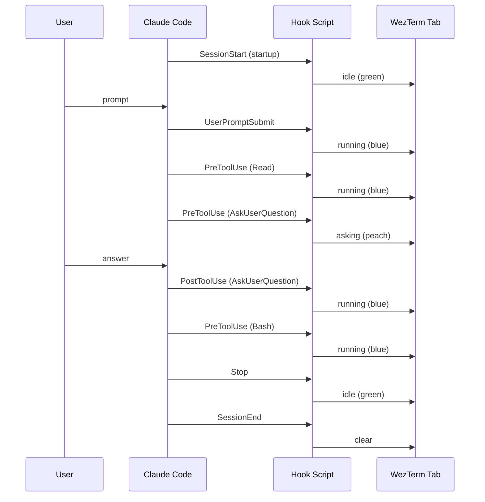
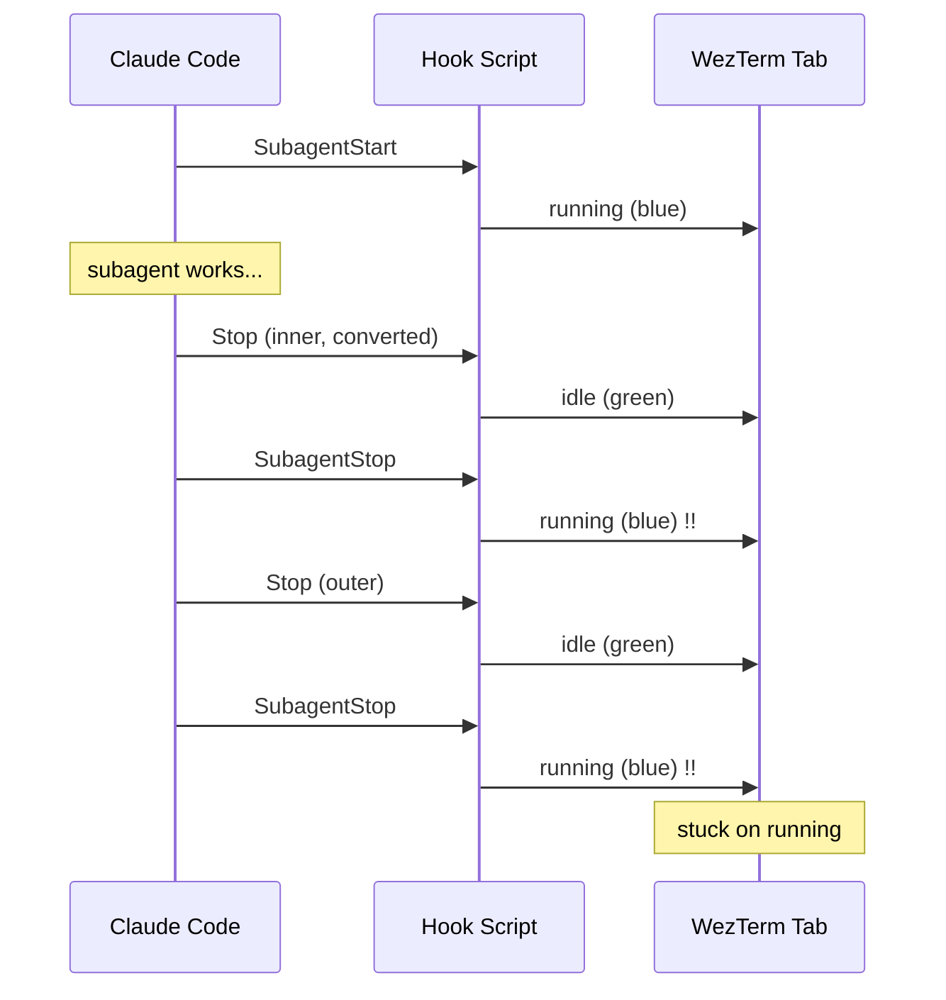
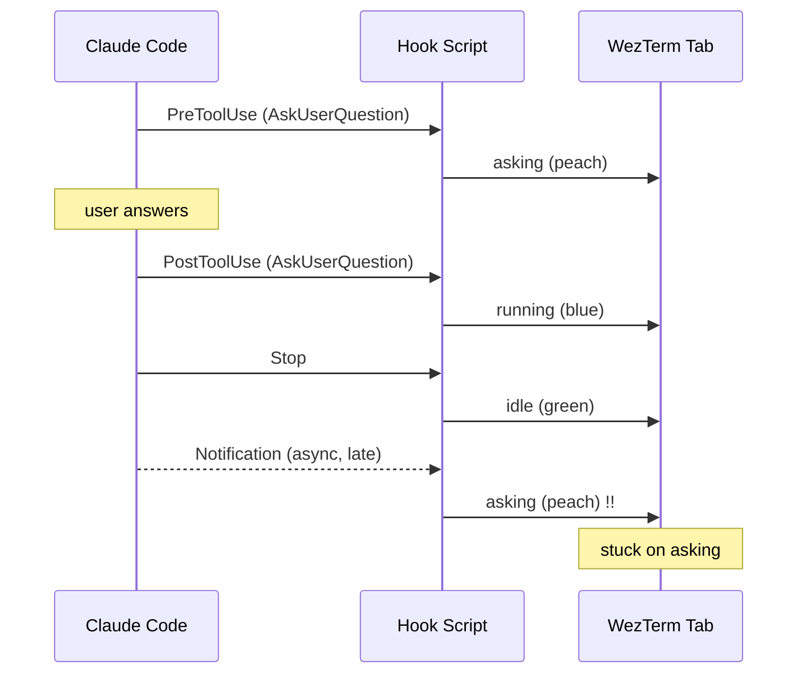

# Hook State Machine

How Claude Code tab state tracking works and why certain hooks are avoided.

## States

| State | Color | Icon | Meaning |
|-------|-------|------|---------|
| `idle` | green | check | Waiting for user prompt |
| `running` | blue | sparkle | Executing tools / thinking |
| `asking` | peach | question | Needs user input |

## Data Flow

Inside tmux, the OSC is wrapped in DCS passthrough (`\ePtmux;...\e\\`).

## Happy Path

## Avoided Hooks

Two hooks were removed after causing race conditions.

### SubagentStop Double-Fire

`SubagentStop` fires **twice** per subagent — the second completes after `Stop`, overwriting idle back to running.

Fix: removed `SubagentStop` entirely. `PreToolUse` and `SubagentStart` already cover all running transitions.

### Notification Async Race

`Notification` hooks are async backup signals that can arrive after `PostToolUse`/`Stop` have already moved the state forward.

Fix: removed all `Notification` hooks. `PermissionRequest` and `PreToolUse` already cover asking transitions synchronously.

## Quick Reference

| Event | Matcher | Emits |
|-------|---------|-------|
| SessionStart | `startup\|resume` | idle |
| UserPromptSubmit | -- | running |
| PreToolUse | `AskUserQuestion\|ExitPlanMode` | asking |
| PreToolUse | `^(?!AskUserQuestion$\|ExitPlanMode$)` | running |
| PostToolUse | -- | running |
| PermissionRequest | -- | asking |
| SubagentStart | -- | running |
| Elicitation | -- | asking |
| Stop | -- | idle |
| StopFailure | -- | idle |
| SessionEnd | -- | clear |
